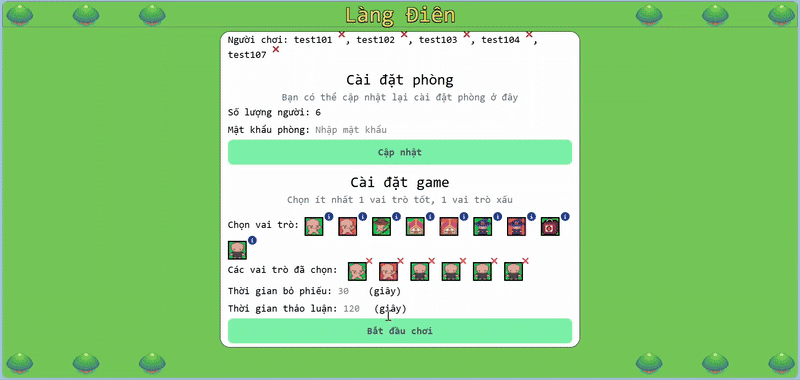

# MAD VILLAGE

   

[Tiếng Việt](./README.vi-VN.md) [日本語](./README.jp-JP.md)
<br>
**Demo Gameplay** <br>


## List of contents

- [About](#about)
  - [Game Instruction](#game-instruction)
  - [Roles](#roles)
    - [Bully good](#bully-good)
    - [Bully bad](#bully-bad)
    - [Witch good](#witch-good)
    - [Witch bad](#witch-bad)
    - [Hunter good](#hunter-good)
    - [Stalker good](#stalker-good)
    - [Stalker bad](#stalker-bad)
    - [Doctor good](#doctor-good)
    - [Villager mad](#villager-mad)
- [Install](#install)
  - [Backend](#backend)
  - [Frontend](#frontend)
- [Credits](#credits)
  - [Assets](#assets)
  - [Game](#game)
  - [Others](#others)

## About
>This is a school project. You're free to use it, but please consider giving credit for some of the assets and images.
### Game Instruction

This game is based on the classic "Werewolf" game, but with some key differences. The basic structure still involves two main groups: the **villagers** and the **werewolves**. However, the **villagers** are further divided into two traits: _good_ and _mad_. The _good_ villagers are those who can perform actions during the game, while the _mad_ villagers are unable to take any actions.

The **werewolves**, representing the _bad_ traits, have the ability to perform more actions than the villagers. The gameplay is divided into several phases, each with specific actions:

- The Night Phase: During this phase, players choose the targets and perform actions.
- The Day Phase: Reported the results of the actions taken in the night phase.
- The Discussion Phase: Players are allowed to chat with each other, discuss the events of the night and try to figure out who the werewolves are.
- The Vote Phase: Players then vote on who they believe should be hanged. The player with the most votes is eliminated from the game.

The game will _end_ when one of the following conditions is met:

- The number of villagers is less than or equal to the number of werewolves.
- There are no werewolves left in the game.

### Roles

#### Bully (good)

- Side: Villagers
- Objective: Assist the villagers in disturbing a werewolf.
- Skill: Lock a target, making them not able to do anything.
- Turn: 1
- Number of skill uses: Unlimited
- Action: lock

#### Bully (bad)

- Side: Werewolves
- Objective: Assist the werewolves in disturbing or killing a villager.
- Skill: Lock a target, making them not able to do anything, or kill them.
- Turn: 1
- Number of skill uses: Unlimited
- Action: lock, kill

#### Witch (good)

- Side: Villagers
- Objective: Assist the villagers in poisoning a werewolf or detoxifying a poisoned villager.
- Skill: Have 2 potions: a poison potion to poison a player, and a potion to detoxify a player.
- Turn: 3
- Number of skill uses: 2
- Action: poison, detox

#### Witch (bad)

- Side: Werewolves
- Objective: Assist the werewolves in poisoning or paralyzing a villager.
- Skill: Have 2 potions: a poison potion to poison a player, and a potion to paralyze a player that makes them not able move.
- Turn: 3
- Number of skill uses: 2
- Action: poison, paralyze

#### Hunter (good)

- Side: Villager
- Objective: Assist the villagers in trapping a werewolf.
- Skill: Put the trap on a player; the trap will be destroyed and kill the werewolf if they step on it.
- Turn: 3
- Number of skill uses: Unlimited until the trap is destroyed.
- Action: trap

#### Stalker (good)

- Side: Villager
- Objective: Assist the villagers in investigating a werewolf.
- Skill: Watch a target to see if any players choose the same one.
- Turn: 2
- Number of skill uses: Unlimited.
- Action: stalk

#### Stalker (bad)

- Side: Werewolves
- Objective: Assist the werewolves in investigating a villager and strike if the time is right.
- Skill: Watch a target to see if any players choose the same one, or kill the target.
- Turn: 2
- Number of skill uses: Unlimited.
- Action: stalk, kill

#### Doctor (good)

- Side: Villagers
- Objective: Assist the villagers in healing or protecting one of their own.
- Skill: Cure a player to cleanse them of harmful effects, or save them if they've been biten.
- Turn: 4
- Number of skill uses: 2.
- Action: cure, save

#### Villager (mad)

*Receive a random good roles*
- Side: Villagers
- Objective: Help the villagers to win the game.
- Skill: Depend on the assigned role, but has no effect.
- Turn: Depend.
- Number of skill uses: Depend.
- Action: Depend.

## Install

### Backend

From your main folder, run
```
cd backend
npm install
nodemon
```

For Unit test, run:
`npm run test`

### Frontend

From your main folder, run
```
cd frontend
npm install
npm run dev
```

## Credits
>I've already purchased all the assets here, but if you want to use them for commercial purposes, please contact the original author.
### Assets

- Characters: [shubibubi](https://shubibubi.itch.io)
- Map and Houses: [cypor](https://cypor.itch.io)
- Bow: [stealthix](https://stealthix.itch.io)
- Medkit: [josupixel](https://josupixel.itch.io)
- Sound track: [Mech Mind Games](https://mech-mind-games.itch.io)

### Game

- Development: [Me](https://github.com/toi-la-qanh) btw :)
- Idea: [Mafia (party game)](<https://en.wikipedia.org/wiki/Mafia_(party_game)>), [Ultimate Werewolf](https://en.wikipedia.org/wiki/Ultimate_Werewolf)

### Others

- [Google Fonts](https://fonts.google.com/icons)
- [Font Awesome Icons](https://fontawesome.com/icons)