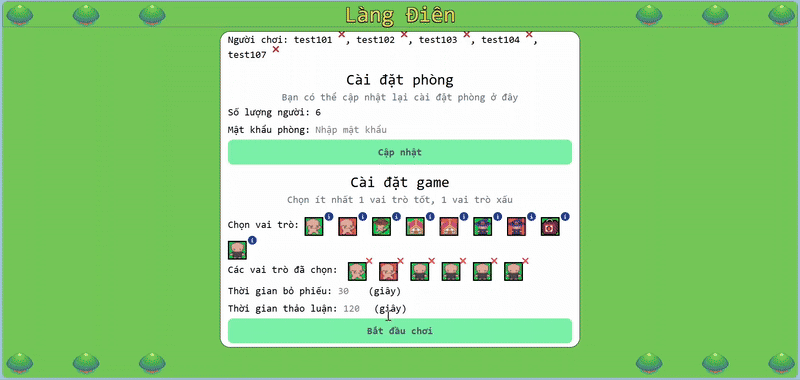

# Làng điên

   

**Demo chơi thử** <br>


## Mục lục

- [Giới thiệu](#gioi-thieu)
  - [Giới thiệu game](#gioi-thieu-tro-choi)
  - [Các vai trò](#cac-vai-tro)
    - [Kẻ bắt nạt tốt](#ke-bat-nat-tot)
    - [Kẻ bắt nạt xấu](#ke-bat-nat-xau)
    - [Phù thủy tốt](#phu-thuy-tot)
    - [Phù thủy xấu](#phu-thuy-xau)
    - [Thợ săn tốt](#tho-san-tot)
    - [Kẻ theo dõi tốt](#ke-theo-doi-tot)
    - [Kẻ theo dõi xấu](#ke-theo-doi-xau)
    - [Bác sĩ tốt](#bac-si-tot)
    - [Dân làng điên](#dan-lang-dien)
- [Cài đặt](#cai-dat)
  - [Backend](#backend)
  - [Frontend](#frontend)
- [Bản quyền](#ban-quyen)
  - [Hình ảnh](#hinh-anh)
  - [Game](#game)
  - [Khác](#khac)

## Giới thiệu {#gioi-thieu}
>Đây là đồ án tốt nghiệp của mình, mọi người có thể sử dụng miễn phí cho mọi mục đích.
### Giới thiệu trò chơi {#gioi-thieu-tro-choi}

Dựa trên trò chơi "Ma sói" cổ điển, nhưng có khác một chút. Cơ bản là sẽ có 2 nhóm chính: **dân làng** và **ma sói**. Tuy nhiên, the **dân làng** có 2 loại: _tốt_ và _điên_.Dân làng _tốt_ là những người có thể thực hiện hành động trong game, còn dân làng _điên_ vẫn có thể thực hiện hành động nhưng không có tác dụng.

**Ma sói**, đại diện cho kẻ _xấu_, sử dụng được nhiều kỹ năng hơn dân làng. Trò chơi chia làm nhiều giai đoạn khác nhau:

- Ban đêm: Người chơi chọn mục tiêu và thực hiện hành động.
- Ban ngày: Báo cáo kết quả đêm qua.
- Thảo luận: Người chơi có thể trò chuyện với nhau, thảo luận xem ai là người khả nghi nhất.
- Bỏ phiếu: Người chơi sẽ chọn mục tiêu để bỏ phiếu. Người có số phiếu nhiều nhất sẽ bị treo cổ.

Các giai đoạn trên sẽ lặp lại cho đến khi:

- Số dân làng ít hơn hoặc bằng số ma sói.
- Không còn ma sói nào nữa.

### Các vai trò {#cac-vai-tro}

#### Kẻ bắt nạt tốt {#ke-bat-nat-tot}

- Phe: Dân làng
- Mục tiêu: Hỗ  trợ dân làng quấy rối ma sói.
- Kỹ năng: Khóa mục tiêu, khiến họ không thể hành động.
- Lượt: 1
- Số lần sử dụng kỹ năng: Không giới hạn
- Hành động: khóa

#### Kẻ bắt nạt xấu {#ke-bat-nat-xau}

- Phe: Ma sói
- Mục tiêu: Hỗ trợ ma sói quấy rối hoặc tiêu diệt dân làng.
- Kỹ năng: Khóa mục tiêu, khiến họ không thể hành động, có thể giết họ nếu cần.
- Lượt: 1
- Số lần sử dụng kỹ năng: Không giới hạn
- Hành động: khóa, giết

#### Phù thủy tốt {#phu-thuy-tot}

- Phe: Dân làng
- Mục tiêu: Giải độc cho dân làng hoặc đầu độc ma sói.
- Kỹ năng: Có 2 bình thuốc: thuốc độc dùng để hạ độc người khác, và thuốc giải độc.
- Lượt: 3
- Số lần sử dụng kỹ năng: 2
- Hành động: hạ độc, giải độc

#### Phù thủy xấu {#phu-thuy-xau}

- Phe: Ma sói
- Mục tiêu: Hỗ trợ ma sói đầu độc hoặc gây quấy rối cho dân làng.
- Kỹ năng: Có 2 bình thuốc: bình thuốc hạ độc người khác, và bình thuốc gây tê liệt khiến mục tiêu không thể hành động.
- Lượt: 3
- Số lần sử dụng kỹ năng: 2
- Hành động: hạ độc, gây tê liệt

#### Thợ săn tốt {#tho-san-tot}

- Phe: Dân làng
- Mục tiêu: Hỗ trợ dân làng bẫy ma sói.
- Kỹ năng: Đặt bẫy lên mục tiêu, ma sói sẽ bị tiêu diệt nếu đạp vào, và cái bẫy sẽ bị phá hủy.
- Lượt: 3
- Số lần sử dụng kỹ năng: Cho đến khi bẫy bị phá.
- Hành động: đặt bẫy

#### Kẻ theo dõi tốt {#ke-theo-doi-tot}

- Phe: Dân làng
- Mục tiêu: Hỗ trợ dân làng thăm dò ma sói.
- Kỹ năng: Theo dõi hành động của người chơi có cùng mục tiêu với mình.
- Lượt: 2
- Số lần sử dụng kỹ năng: Không giới hạn.
- Hành động: theo dõi

#### Kẻ theo dõi xấu {#ke-theo-doi-xau}

- Phe: Ma sói
- Mục tiêu: Hỗ trợ ma sói thăm dò dân làng, thậm chí có thể giết mục tiêu.
- Kỹ năng: Theo dõi hành động của người chơi có cùng mục tiêu với mình, và giết mục tiêu.
- Lượt: 2
- Số lần sử dụng kỹ năng: Không giới hạn.
- Hành động: theo dõi, giết

#### Bác sĩ tốt {#bac-si-tot}

- Phe: Dân làng
- Mục tiêu: Trị thương cho dân làng hoặc cứu họ.
- Kỹ năng: Chữa trị cho mục tiêu hóa giải hiệu ứng xấu, hoặc cứu họ nếu họ bị giết.
- Lượt: 4
- Số lần sử dụng kỹ năng: 2.
- Hành động: trị thương, cứu

#### Dân làng điên {#dan-lang-dien}

*Nhận một vai trò tốt ngẫu nhiên*
- Phe: Dân làng
- Mục tiêu: Hỗ trợ dân làng giành chiến thắng.
- Kỹ năng: Tùy theo vai trò nhận được, nhưng sẽ không có tác dụng khi dùng.
- Turn: Tùy theo vai trò nhận được.
- Số lần sử dụng kỹ năng: Tùy theo vai trò nhận được.
- Hành động: Tùy theo vai trò nhận được.

## Cài đặt {#cai-dat}

### Backend

```
cd backend
npm install
nodemon
```

Kiểm thử :
`npm run test`

### Frontend

```
cd frontend
npm install
npm run dev
```

## Bản quyền {#ban-quyen}
>Mấy cái hình ảnh mình mua hết rồi nhưng nếu mọi người muốn sử dụng cho mục đích mua bán, thì nên liên hệ tác giả.
### Hình ảnh {#hinh-anh}

- Nhân vật: [shubibubi](https://shubibubi.itch.io)
- Bản đồ và các ngôi nhà: [cypor](https://cypor.itch.io)
- Cung tên: [stealthix](https://stealthix.itch.io)
- Hộp trị thương: [josupixel](https://josupixel.itch.io)
- Nhạc: [Mech Mind Games](https://mech-mind-games.itch.io)

### Game

- Nhà phát triển: [Mình](https://github.com/toi-la-qanh) :)
- Ý tưởng: [Mafia (party game)](<https://en.wikipedia.org/wiki/Mafia_(party_game)>), [Ultimate Werewolf](https://en.wikipedia.org/wiki/Ultimate_Werewolf)

### Khác {#khac}

- [Google Fonts](https://fonts.google.com/icons)
- [Font Awesome Icons](https://fontawesome.com/icons)